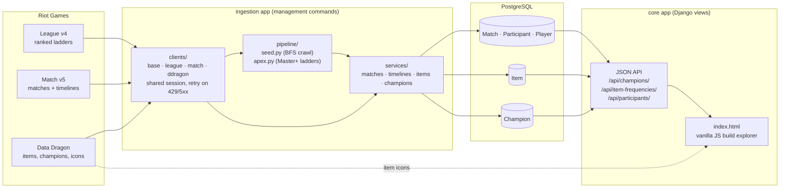
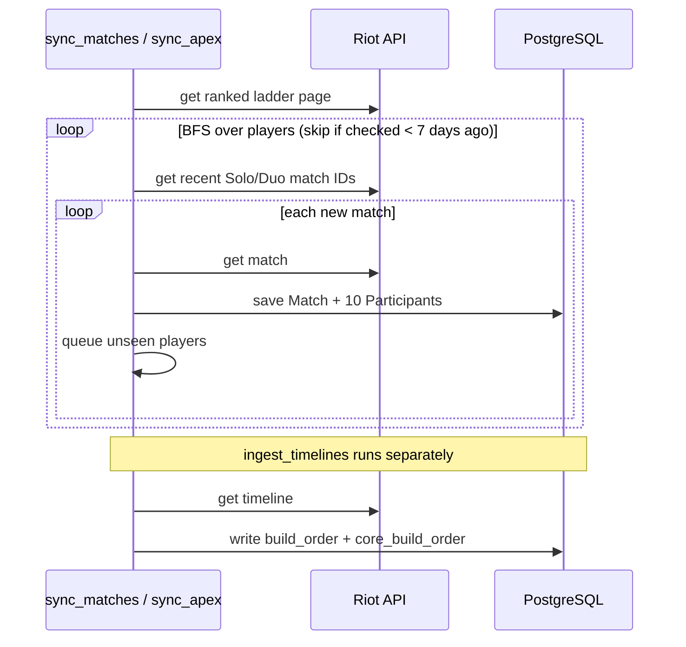

# buildpath

A Django app that collects League of Legends ranked Solo/Duo matches from the Riot API, stores them in PostgreSQL, and shows which item build paths each champion uses most often and how often they win.

The dataset currently holds about 190k matches and 1.9M participant records.

## What it does

1. **Ingests matches.** Starting from a page of ranked players (or the Master/Grandmaster/Challenger ladders), it crawls breadth-first through each player's recent matches and the other players in those matches. Only Ranked Solo/Duo (queue 420) is stored, and each match is tagged with the rank tier it was collected from.
2. **Ingests timelines.** For each match it fetches the timeline and records every item each participant bought, in order (`build_order`). It also keeps a filtered list of just the completed legendary items (`core_build_order`). Boots, components, and consumables are excluded.
3. **Syncs static data.** It pulls items and champions from Data Dragon. Item data such as recipe trees, gold cost, and icons decides what counts as a "core" item.
4. **Serves a build explorer.** A plain HTML/JS page lets you pick a champion and step through its most common core item paths. Each row shows the next item's pick count and win rate, given the items already chosen.

## Architecture



### Django apps

| App | Role |
| --- | --- |
| `ingestion` | Riot API clients, crawl pipelines, ingestion services, and all management commands |
| `matches` | `Player`, `Match`, `Participant` models (participants hold final items plus `build_order` / `core_build_order`) |
| `items` | `Item` model synced from Data Dragon (recipe tree, gold, tags, stats) |
| `champions` | `Champion` model synced from Data Dragon |
| `core` | JSON API and the build explorer frontend |

### Ingestion flow



A **core item** is an item that builds into nothing (`into_items = []`) and costs at least 2200 gold. That threshold keeps support legendaries like Shurelya's and leaves out every boot and component.

## API

| Endpoint | Description |
| --- | --- |
| `GET /api/champions/` | List of champion names |
| `GET /api/item-frequencies/?champion=&slot=&path=&rank=` | Items bought in core slot `slot`, filtered to games whose earlier core items match `path` (comma-separated item IDs). Returns `item_id`, `icon`, `count`, `winrate`, sorted by count. `rank` is optional: `EMERALD+` or `MASTER+` |
| `GET /api/participants/?champion=&rank=` | Raw participant rows |

## Running it

### Configuration

Create `buildpath/.env`:

```env
API_KEY=RGAPI-...        # Riot developer key
DB_NAME=buildpath_db
DB_USER=buildpath_user
DB_PASSWORD=...
DB_HOST=localhost
DB_PORT=5432
DEBUG=True
```

### With Docker (recommended)

From `buildpath/`:

```sh
docker compose up        # starts Postgres + the web app at http://localhost:8000
```

Compose overrides `DB_HOST` to point at the `db` container. Postgres is also published on host port `5433`. Migrations run automatically when the web container starts.

Run management commands inside the container:

```sh
docker compose exec web python manage.py <command>
```

### Without Docker

```sh
python -m venv venv
venv\Scripts\activate            # Windows
pip install -r buildpath/requirements.txt
cd buildpath
python manage.py migrate
python manage.py runserver
```

### Management commands

```sh
# Static data
python manage.py sync_items
python manage.py sync_champions

# Match ingestion
python manage.py sync_matches --region na1 --tier GOLD --division I [--max-players N]
python manage.py sync_apex --region na1 --tier CHALLENGER [--max-players N]
python manage.py ingest_timelines [--limit N]

# Maintenance
python manage.py populate_core_builds            # rebuild core_build_order from build_order
python manage.py fix_incomplete_matches [--dry-run] [--min-participants N]
python manage.py stats_matches                   # matches per tier
python manage.py stats_players
python manage.py clear_matches
python manage.py clear_items
```

A typical first run is `sync_items`, `sync_champions`, then `sync_matches` (or `sync_apex`), then `ingest_timelines`.

## Stack

Python 3.14 · Django 6.0 · PostgreSQL 18 · requests · Docker Compose
